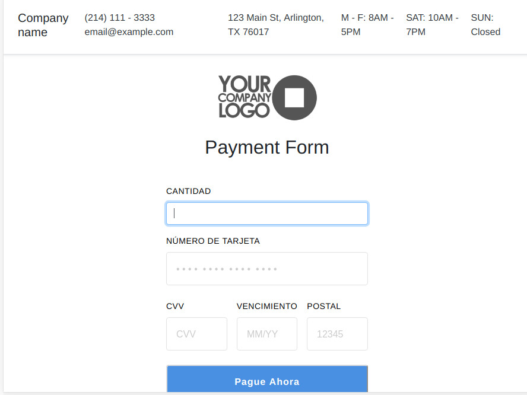

# Square Payment Form


This project demonstrates processing card payments with Square Connect API, using the
Square Connect PHP client library. The project gives the domain owner the ability to enter custom monetary amounts, in case their reader does not work.

## Live Demo

[Click for a Live Demo Here](https://staging2.supersuccess.win/square/)

## Installing

1. Make sure you've downloaded Composer, following the instructions
[here](https://getcomposer.org/download/).

2. Run the following command from the directory containing `composer.json`:

```
composer install
```
3. Populate a .env file with your Square credentials. If you plan on using sandbox, then set
USE_PROD=false. (<b>WARNING</b>: never upload .env with your credentials/access_token.) See
[this article](https://docs.connect.squareup.com/articles/using-sandbox/)
for more information on the API sandbox.


```
PROD_ACCESS_TOKEN=
PROD_APP_ID=
PROD_LOCATION_ID=
SANDBOX_ACCESS_TOKEN=
SANDBOX_APP_ID=
SANDBOX_LOCATION_ID=
USE_PROD=
```
## Running the sample

From the sample's root directory, run:

    php -S localhost:8000

You can then visit `localhost:8000` in your browser to see the card form.

If you're using your sandbox credentials, you can test a valid credit card
transaction by providing the following card information in the form:

* Card Number `4532 7597 3454 5858`
* Card CVV `111`
* Card Expiration (Any time in the future)
* Card Postal Code (Any valid US postal code)

You can find more testing values in this [article](https://docs.connect.squareup.com/articles/using-sandbox)

**Note that if you are _not_ using your sandbox credentials and you enter _real_
credit card information, YOU WILL CHARGE THE CARD.**

## Deployment

Populate a .env file with your Square credentials. If you plan on using in production, then set USE_PROD=true.

## Built With

* [Square](https://github.com/square/connect-api-examples) - Square Web API
* [phpdotenv](https://github.com/vlucas/phpdotenv) - Loads environment variables

## License

This project is licensed under the MIT License - see the [LICENSE.md](LICENSE.md) file for details

